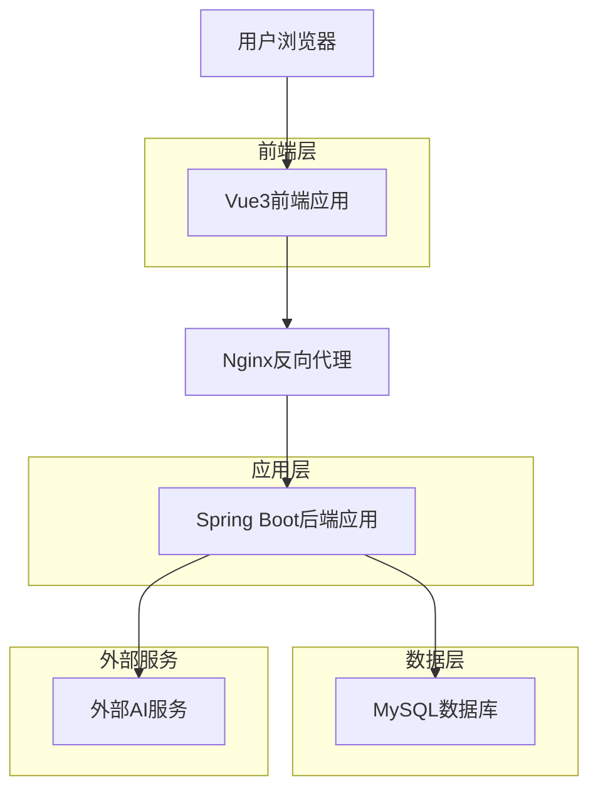

# 智能体服务平台技术方案文档

## 1. 技术选型

### 1.1 前端技术栈

#### 1.1.1 核心框架

* **框架**：Vue3 + TypeScript

  * Vue3 提供 Composition API，支持更好的逻辑复用和类型推导

  * TypeScript 提供严格的类型检查，提升代码质量和开发效率

  * 版本：Vue 3.3+ 和 TypeScript 5.0+

#### 1.1.2 UI组件库

* **UI组件库**：Radix UI

  * 提供无样式、可访问性优先的组件基础

  * 支持完全自定义样式，符合平台设计需求

  * 组件包括：Dialog、Dropdown、Select、Toast等

#### 1.1.3 构建工具

* **构建工具**：Vite

  * 快速的开发服务器和构建工具

  * 原生ES模块支持，热更新速度快

  * 插件生态丰富，支持Vue3和TypeScript

#### 1.1.4 状态管理

* **状态管理**：Pinia

  * Vue3官方推荐的状态管理库

  * 提供类型安全的状态管理

  * 支持组合式API风格

#### 1.1.5 路由管理

* **路由**：Vue Router 4

  * Vue3官方路由库

  * 支持TypeScript类型推导

  * 提供路由守卫和动态路由功能

### 1.2 后端技术栈

#### 1.2.1 核心框架

* **框架**：Spring Boot 2.7

  * 成熟稳定的企业级框架

  * 丰富的生态系统和社区支持

  * 自动配置和约定优于配置

#### 1.2.2 开发语言

* **语言**：Java 8

  * 企业级应用的标准选择

  * 丰富的第三方库支持

  * 良好的性能和稳定性

#### 1.2.3 构建工具

* **构建工具**：Maven

  * 标准的Java项目构建工具

  * 依赖管理和项目生命周期管理

  * 与Spring Boot完美集成

#### 1.2.4 数据库

* **数据库**：MySQL 8.0

  * 高性能的关系型数据库

  * 支持JSON数据类型，满足扩展需求

  * 成熟的运维工具和监控方案

#### 1.2.5 ORM框架

* **ORM**：MyBatis-Plus

  * 基于MyBatis的增强工具

  * 提供代码生成器和通用CRUD操作

  * 支持分页、条件构造器等高级功能

#### 1.2.6 安全框架

* **认证**：Spring Security

  * 企业级安全框架

  * 支持多种认证方式

  * 提供细粒度的权限控制

## 2. 技术架构

### 2.1 整体架构

#### 2.1.1 架构模式

* **前后端分离架构**

  * 前端负责用户界面和交互逻辑

  * 后端提供API服务和业务逻辑

  * 通过RESTful API进行数据交互

#### 2.1.2 API接口规范

* **RESTful API接口规范**

  * 统一的HTTP状态码使用

  * 标准的资源命名规范

  * 统一的响应数据格式

#### 2.1.3 部署模式

* **单体应用部署模式**

  * 适合初期快速开发和部署

  * 降低系统复杂度和运维成本

  * 便于调试和问题定位

### 2.2 前端架构

#### 2.2.1 组件化开发

* **基于Vue3的组件化开发**

  * 采用单文件组件（SFC）开发模式

  * 组件按功能模块划分，提高复用性

  * 使用Props和Emit进行组件通信

#### 2.2.2 目录结构

* **按功能模块划分目录结构**

```
src/
├── components/          # 通用组件
├── views/              # 页面组件
│   ├── portal/         # 门户展示层
│   ├── user/           # 用户服务层
│   ├── agent/          # 智能体服务层
│   ├── dataset/        # 数据管理层
│   ├── market/         # 市场交易层
│   └── admin/          # 系统管理层
├── stores/             # Pinia状态管理
├── router/             # 路由配置
├── api/                # API接口封装
├── utils/              # 工具函数
└── types/              # TypeScript类型定义
```

#### 2.2.3 开发模式

* **采用Composition API编写逻辑**

  * 更好的逻辑复用和组织

  * 更好的TypeScript支持

  * 更清晰的代码结构

#### 2.2.4 类型检查

* **严格类型检查的TypeScript环境**

  * 启用strict模式

  * 定义完整的接口类型

  * 使用泛型提高代码复用性

### 2.3 后端架构

#### 2.3.1 分层架构

* **标准MVC分层架构**

```
├── Controller层        # 控制器层，处理HTTP请求
├── Service层           # 业务逻辑层
├── Repository层        # 数据访问层
└── Entity层            # 实体层
```

#### 2.3.2 异常处理

* **统一异常处理机制**

  * 全局异常处理器

  * 自定义业务异常类

  * 统一错误码和错误信息

#### 2.3.3 响应封装

* **全局响应封装**

  * 统一的响应数据结构

  * 标准化的成功和失败响应

  * 支持分页数据封装

#### 2.3.4 配置管理

* **多环境配置管理**

  * 开发、测试、生产环境配置分离

  * 敏感信息加密存储

  * 配置热更新支持

### 2.4 架构设计图



## 3. 实施路径

### 3.1 阶段一：环境搭建（2周）

#### 3.1.1 项目初始化

* **前端项目初始化**

  * 使用Vite创建Vue3+TypeScript项目

  * 配置ESLint、Prettier代码规范

  * 集成Radix UI组件库

  * 配置Pinia状态管理

  * 设置Vue Router路由

* **后端项目初始化**

  * 使用Spring Initializr创建Spring Boot项目

  * 集成MyBatis-Plus和MySQL驱动

  * 配置Spring Security基础认证

  * 设置多环境配置文件

  * 配置统一异常处理和响应封装

#### 3.1.2 开发环境配置

* **开发工具配置**

  * IDE配置（IntelliJ IDEA、VS Code）

  * 数据库连接和管理工具

  * API测试工具（Postman）

  * 版本控制工具（Git）

* **数据库环境**

  * MySQL 8.0安装和配置

  * 数据库表结构创建

  * 初始数据导入

  * 数据库连接池配置

#### 3.1.3 CI/CD基础流程

* **版本控制**

  * Git分支策略制定

  * 代码提交规范

  * Pull Request流程

* **自动化构建**

  * 前端构建脚本

  * 后端打包配置

  * 自动化测试集成

### 3.2 阶段二：核心功能开发（6周）

#### 3.2.1 用户模块开发（1.5周）

* **用户认证功能**

  * 用户注册（邮箱验证码）

  * 用户登录/登出

  * JWT Token管理

  * 权限验证中间件

* **账户管理功能**

  * 个人信息管理

  * 密码修改

  * 账户设置

#### 3.2.2 智能体服务模块开发（2.5周）

* **Playground交互功能**

  * 智能体选择界面

  * 实时对话交互

  * 对话历史记录

  * 交互事件展示

* **Overview管理功能**

  * API Key生成和管理

  * API调用统计

  * 代码示例展示

  * 配置管理界面

* **模型配置功能**

  * MCP模型选择和配置

  * 模型参数调优

  * 记忆功能开关

  * 上下文管理

#### 3.2.3 数据管理模块开发（1.5周）

* **数据集管理功能**

  * 数据集创建和上传

  * 数据格式验证和解析

  * 数据集编辑和更新

  * 数据集查看和下载

  * 数据集检索和筛选

#### 3.2.4 门户展示模块开发（0.5周）

* **首页门户功能**

  * 平台介绍页面

  * 文档中心

  * 订阅计划展示

  * 基础布局管理

### 3.3 阶段三：测试与优化（3周）

#### 3.3.1 单元测试与集成测试（1.5周）

* **前端测试**

  * Jest单元测试

  * 组件测试

  * E2E测试（Cypress）

  * 测试覆盖率要求：>80%

* **后端测试**

  * JUnit单元测试

  * Spring Boot集成测试

  * API接口测试

  * 数据库测试

#### 3.3.2 性能优化与安全加固（1周）

* **性能优化**

  * 前端代码分割和懒加载

  * 图片压缩和CDN配置

  * 数据库查询优化

  * 缓存策略实施

* **安全加固**

  * SQL注入防护

  * XSS攻击防护

  * CSRF防护

  * 敏感数据加密

#### 3.3.3 用户体验改进（0.5周）

* **界面优化**

  * 响应式设计完善

  * 加载状态优化

  * 错误提示优化

  * 用户操作流程优化

### 3.4 阶段四：部署上线（2周）

#### 3.4.1 生产环境部署（1周）

* **服务器环境准备**

  * 服务器配置和安全设置

  * 数据库生产环境配置

  * 域名和SSL证书配置

  * 负载均衡配置

* **应用部署**

  * 前端静态资源部署

  * 后端应用部署

  * 数据库迁移

  * 配置文件管理

#### 3.4.2 监控系统接入（0.5周）

* **应用监控**

  * 应用性能监控（APM）

  * 错误日志收集

  * 业务指标监控

  * 告警机制配置

#### 3.4.3 运维文档编写（0.5周）

* **文档编写**

  * 部署文档

  * 运维手册

  * 故障排查指南

  * API文档

## 4. 其他考虑

### 4.1 开发规范

#### 4.1.1 统一的代码风格指南

* **前端代码规范**

  * ESLint + Prettier配置

  * Vue3 Composition API最佳实践

  * TypeScript编码规范

  * 组件命名和文件组织规范

* **后端代码规范**

  * Java编码规范（Google Java Style）

  * Spring Boot最佳实践

  * 数据库命名规范

  * API接口设计规范

- <br />

#### 4.1.3 API文档规范

* **文档标准**

  * OpenAPI 3.0规范

  * Swagger UI集成

  * 接口版本管理

  * 请求/响应示例

### 4.2 质量保障

####

#### 4.2.3 Postman接口测试

* **API测试**

  * 接口功能测试

  * 接口性能测试

  * 接口安全测试

  * 自动化回归测试

### 4.3 扩展性设计

#### 4.3.1 模块化功能设计

* **前端模块化**

  * 组件库抽象

  * 插件化架构

  * 微前端预留

  * 主题系统支持

* **后端模块化**

  * 服务层抽象

  * 插件机制设计

  * 微服务拆分预留

  * 事件驱动架构

#### 4.3.2 可配置化方案

* **配置管理**

  * 动态配置中心

  * 功能开关管理

  * 多租户支持

  * 个性化配置

#### 4.3.3 清晰的接口抽象

* **接口设计**

  * 统一的服务接口

  * 标准化的数据传输对象

  * 版本兼容性设计

  * 扩展点预留

### 4.4 技术风险与应对

#### 4.4.1 技术风险识别

* **性能风险**：大量并发请求处理

* **安全风险**：用户数据和API安全

* **可用性风险**：系统稳定性保障

* **扩展性风险**：业务快速增长适应

#### 4.4.2 风险应对策略

* **性能优化**：缓存策略、数据库优化、CDN加速

* **安全加固**：多层安全防护、数据加密、权限控制

* **高可用设计**：负载均衡、故障转移、监控告警

* **架构演进**：模块化设计、微服务预留、云原生支持

***

**文档版本**：v1.0\
**编写日期**：2024年\
**适用范围**：智能体服务平台技术实施\
**维护团队**：技术架构组
