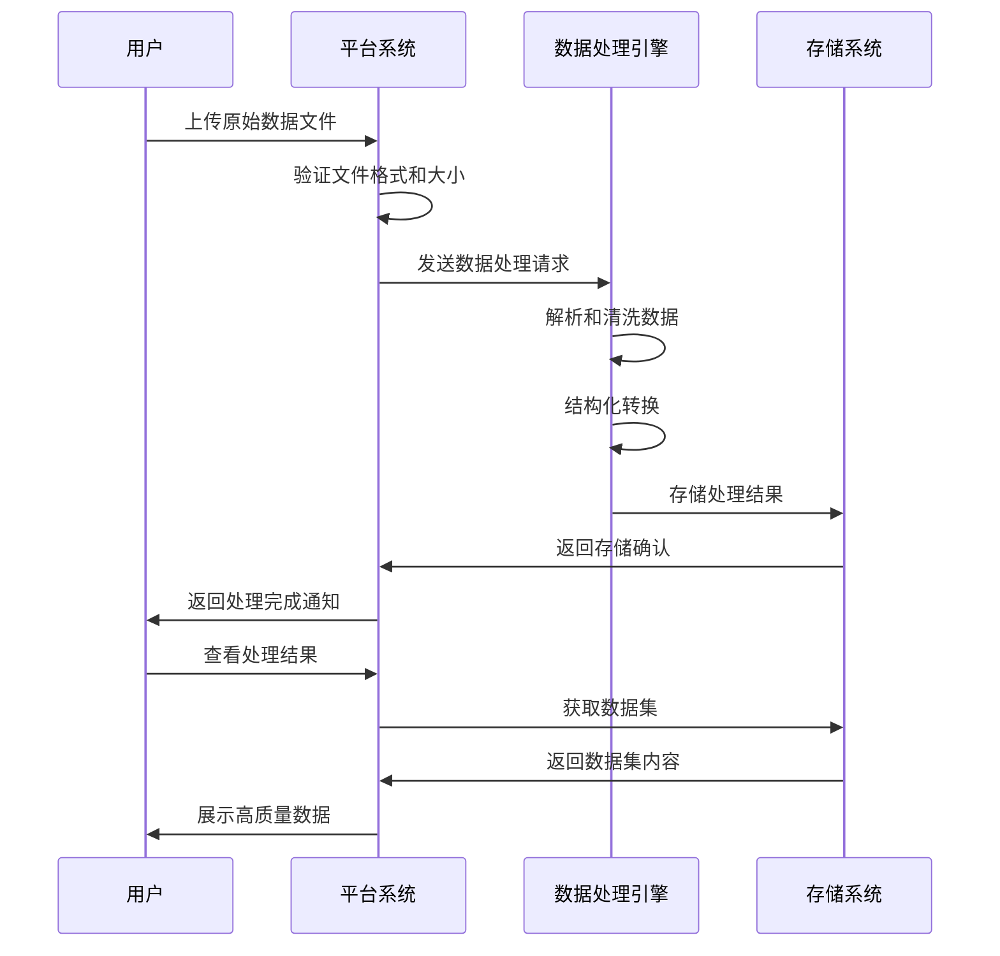
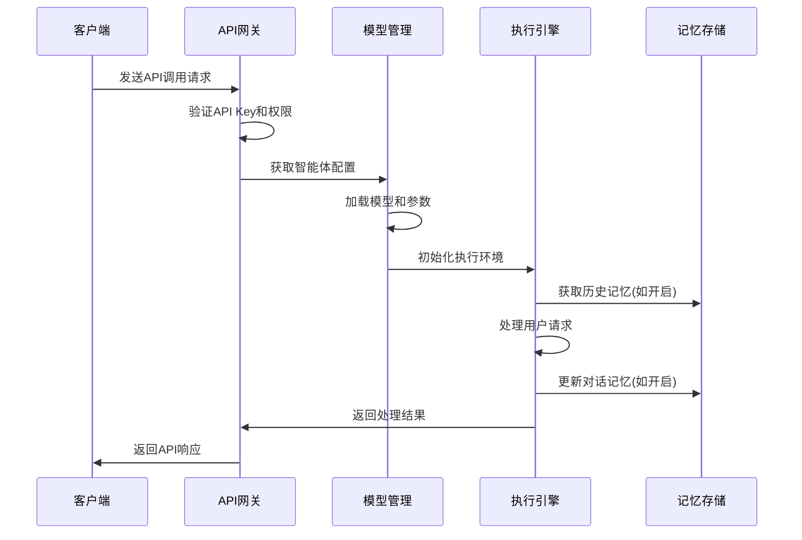
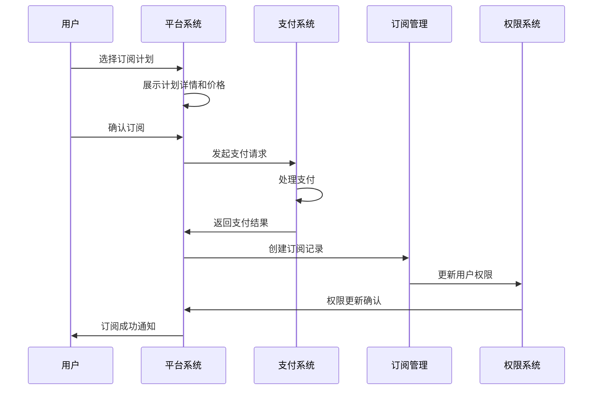

# 智能体服务平台需求规格说明书

## 1. 系统目标定义

### 1.1 项目概述
Poping是一个面向API销售模式的智能体服务平台，致力于为客户提供数据处理、智能体配置和模型记忆等核心能力，帮助用户将混乱数据转化为高质量数据，并通过标准化API接口对外提供智能体服务。

### 1.2 业务目标
- **数据价值转化**：将非结构化、混乱的原始数据转化为高质量、可用的结构化数据
- **智能体服务化**：提供可配置、可调用的智能体API服务
- **商业化运营**：通过订阅制和API调用计费实现平台商业价值
- **生态建设**：构建MCP模型市场，支持第三方模型和工具接入

### 1.3 用户群体
- **主要用户**：需要数据处理和智能体服务的企业开发者
- **管理用户**：平台运营管理人员

## 2. 系统模块架构

### 2.1 一级模块架构
```
智能体市场Web平台
├── 门户展示层
├── 用户服务层  
├── 智能体服务层
├── 数据管理层
├── 市场交易层
└── 系统管理层
```

### 2.2 模块关系图
```
门户展示层 ←→ 用户服务层 ←→ 智能体服务层
     ↓            ↓            ↓
市场交易层 ←→ 数据管理层 ←→ 系统管理层
```

## 3. 功能模块说明

### 3.1 门户展示层

#### 3.1.1 首页门户模块
**功能描述**：提供平台入口和基础信息展示

**二级功能模块**：
- **文档中心**
  - 前置条件：用户访问平台首页
  - 处理逻辑：展示系统使用文档、API文档、操作指南等
  - 后置结果：用户获取平台使用信息
  
- **订阅展示**
  - 前置条件：用户浏览平台服务
  - 处理逻辑：展示订阅计划、价格体系、服务内容
  - 后置结果：引导用户进行订阅决策

- **布局管理**
  - 前置条件：管理员配置页面内容
  - 处理逻辑：管理首页布局、文档结构、订阅页面展示
  - 后置结果：优化用户浏览体验

### 3.2 用户服务层

#### 3.2.1 用户管理模块
**功能描述**：处理用户注册、登录、账户管理等基础服务

**二级功能模块**：
- **用户认证**
  - 前置条件：用户需要访问平台服务
  - 处理逻辑：邮箱验证码注册、登录验证、未登录拦截
  - 后置结果：用户获得平台访问权限
  
- **账户管理**
  - 前置条件：用户已完成注册登录
  - 处理逻辑：个人信息维护、密码修改、账户设置
  - 后置结果：用户账户信息更新

- **订阅管理**
  - 前置条件：用户需要使用付费服务
  - 处理逻辑：订阅计划选择、支付处理、订阅状态管理
  - 后置结果：用户获得对应服务权限

### 3.3 智能体服务层

#### 3.3.1 AI智能体平台模块
**功能描述**：提供智能体交互和管理的核心功能

**二级功能模块**：
- **Playground交互**
  - 前置条件：用户已登录且有可用智能体
  - 处理逻辑：选择智能体、发起对话、查看交互事件
  - 后置结果：完成智能体对话交互
  
- **Overview管理**
  - 前置条件：用户需要集成API服务
  - 处理逻辑：API Key生成管理、调用统计、配置管理、代码示例提供
  - 后置结果：用户获得API集成能力

#### 3.3.2 模型配置模块
**功能描述**：支持智能体的模型和参数配置

**二级功能模块**：
- **MCP模型管理**
  - 前置条件：用户需要配置智能体模型
  - 处理逻辑：模型选择、参数配置、模型切换
  - 后置结果：智能体模型配置完成
  
- **记忆功能管理**
  - 前置条件：用户需要智能体具备记忆能力
  - 处理逻辑：记忆功能开关、上下文管理、对话历史维护
  - 后置结果：智能体具备记忆交互能力

### 3.4 数据管理层

#### 3.4.1 数据集管理模块
**功能描述**：处理数据上传、解析、转化的核心功能

**二级功能模块**：
- **数据集创建**
  - 前置条件：用户需要处理原始数据
  - 处理逻辑：文档上传、格式验证、数据解析
  - 后置结果：生成可用数据集
  
- **数据集编辑**
  - 前置条件：数据集已存在
  - 处理逻辑：数据更新、重新解析、内容修改
  - 后置结果：数据集内容更新
  
- **数据集查看**
  - 前置条件：用户有数据集访问权限
  - 处理逻辑：数据浏览、解析结果查看、数据下载
  - 后置结果：用户获取处理后的数据
  
- **数据集检索**
  - 前置条件：用户需要查找特定数据集
  - 处理逻辑：列表展示、搜索过滤、分页显示
  - 后置结果：用户找到目标数据集

### 3.5 市场交易层

#### 3.5.1 MCP市场模块
**功能描述**：提供模型和工具的市场化交易功能

**二级功能模块**：
- **市场展示**
  - 前置条件：平台有可用的MCP资源
  - 处理逻辑：MCP列表展示、分类筛选、详情查看
  - 后置结果：用户了解可用的模型和工具

### 3.6 系统管理层

#### 3.6.1 管理后台模块
**功能描述**：提供平台运营和管理功能

**二级功能模块**：
- **用户管理**
  - 前置条件：管理员需要管理平台用户
  - 处理逻辑：用户权限管理、账户状态控制、使用统计
  - 后置结果：平台用户得到有效管理
  
- **模型供应商管理**
  - 前置条件：需要接入第三方模型服务
  - 处理逻辑：模型配置，测试链接
  - 后置结果：第三方服务成功接入平台
  
- **MCP管理**
  - 前置条件：需要管理平台模型资源
  - 处理逻辑：模型配置管理、参数调优、性能监控
  - 后置结果：平台模型服务稳定运行

## 4. 核心业务泳道图

### 4.1 数据处理业务流程



### 4.2 智能体API调用业务流程



### 4.3 用户订阅业务流程



## 5. 功能优先级分类

### 5.1 核心功能（MVP）
- 用户注册登录
- 数据上传和处理
- 智能体配置和调用
- API Key管理
- 基础订阅功能

### 5.2 重要功能
- 记忆功能管理
- Playground交互环境
- 数据集管理
- 调用统计和监控

### 5.3 扩展功能
- MCP市场
- 高级数据处理
- 多模型切换
- 详细分析报告

## 6. 非功能性需求

### 6.1 性能要求
- API响应时间：< 2秒
- 数据处理能力：支持100MB以内文件
- 并发用户：支持1000+在线用户

### 6.2 安全要求
- 数据传输加密
- API Key安全管理
- 用户数据隔离
- 访问权限控制

### 6.3 可用性要求
- 系统可用性：99.9%
- 7x24小时服务
- 故障恢复时间：< 30分钟