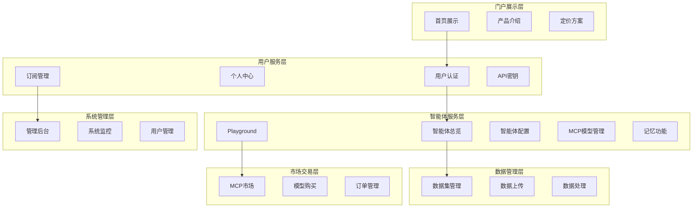
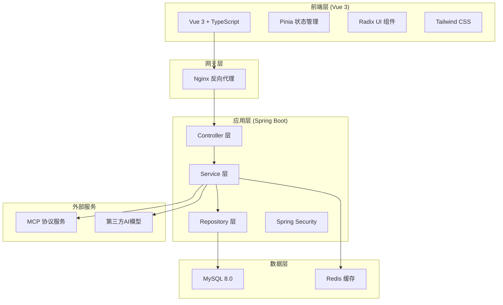
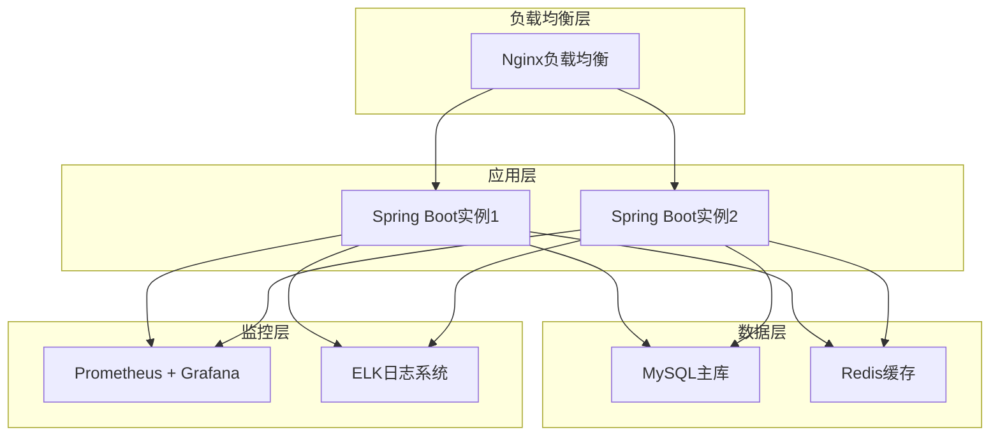

# 智能体服务平台完整实施计划与技术路线图

## 执行摘要

本文档基于对智能体服务平台工作空间的全面分析，制定了一份详细的实施计划与技术路线图。该平台采用**六层业务架构**（门户展示层、用户服务层、智能体服务层、数据管理层、市场交易层、系统管理层），技术栈为**Vue 3 + Spring Boot 2.7 + MySQL 8.0**，集成**MCP协议**提供智能体服务。

**核心目标**：构建一个高性能、可扩展的智能体服务平台，支持用户创建、配置和使用智能体，提供数据集管理、MCP模型市场等完整功能。

## 1. 系统架构概览

### 1.1 业务架构图



### 1.2 技术架构图



## 2. 详细实施计划

### 2.1 项目阶段划分

#### 阶段一：基础架构搭建（第1-2周）

**目标**：完成项目初始化和基础架构搭建

**前端任务**：
- ✅ 创建Vue 3 + TypeScript + Vite项目
- ✅ 配置ESLint、Prettier、Husky代码规范
- ✅ 集成Radix UI组件库和Tailwind CSS
- ✅ 配置Pinia状态管理和Vue Router
- ✅ 实现设计系统基础组件（Button、Input、Card等）
- ✅ 建立响应式布局系统

**后端任务**：
- ✅ 创建Spring Boot 2.7项目结构
- ✅ 配置Maven依赖管理
- ✅ 集成MyBatis-Plus和MySQL 8.0
- ✅ 配置Spring Security基础认证
- ✅ 执行数据库建表脚本
- ✅ 创建Entity实体类和基础Repository

**交付物**：
- 前后端项目脚手架
- 基础组件库
- 数据库表结构
- 开发环境配置文档

#### 阶段二：核心功能开发（第3-10周）

**2.1 用户服务层开发（第3-4周）**

*前端开发*：
- 用户注册/登录页面
- 个人中心界面
- 订阅管理页面
- API密钥管理界面
- 账单与支付页面

*后端开发*：
- 用户认证API（注册、登录、JWT令牌）
- 用户信息管理API
- 角色权限管理API
- 订阅服务API
- API密钥管理API

**2.2 智能体服务层开发（第5-7周）**

*前端开发*：
- 智能体总览页面
- Playground交互界面（实时对话）
- 智能体配置页面
- MCP模型管理界面
- 记忆功能管理页面

*后端开发*：
- 智能体实例管理API
- Playground对话接口
- 智能体核心服务接口
- MCP配置管理API
- 记忆功能API

**2.3 数据管理层开发（第8-9周）**

*前端开发*：
- 数据集管理页面
- 数据上传界面（支持多种格式）
- 数据处理状态页面
- 数据集详情页面

*后端开发*：
- 数据集上传API
- 数据处理状态API
- 数据集查询与管理API
- 文件存储服务

**2.4 门户展示层开发（第10周）**

*前端开发*：
- 首页Landing Page
- 产品介绍页面
- 定价方案页面
- 关于我们页面

*后端开发*：
- 门户内容管理API
- 静态资源服务

#### 阶段三：高级功能开发（第11-13周）

**3.1 市场交易层开发（第11-12周）**

*前端开发*：
- MCP市场页面
- 模型详情页面
- 购买与订阅流程
- 订单管理页面

*后端开发*：
- MCP市场API
- 模型购买接口
- 订单管理API
- 支付服务集成

**3.2 系统管理层开发（第13周）**

*前端开发*：
- 管理后台界面
- 系统监控面板
- 用户管理页面
- 配置管理界面

*后端开发*：
- 系统监控API
- 用户管理API
- 配置管理API
- 日志管理API

#### 阶段四：集成优化与测试（第14-15周）

**4.1 外部服务集成（第14周）**
- 智能体核心服务完善
- MCP协议实现
- 邮件服务集成
- 支付服务完善

**4.2 性能优化与测试（第15周）**
- Redis缓存实现
- 数据库查询优化
- 前端性能优化
- 单元测试和集成测试
- E2E测试
- 安全测试

### 2.2 里程碑与交付物

#### 里程碑1：基础架构完成（第2周末）

**验收标准**：
- ✅ 前后端项目可正常启动
- ✅ 基础API接口可正常调用
- ✅ 数据库连接正常
- ✅ 代码规范检查通过
- ✅ 基础组件库可用

**交付物**：
- 项目脚手架代码
- 基础组件库
- 数据库设计文档
- 开发环境搭建指南

#### 里程碑2：核心功能MVP（第10周末）

**验收标准**：
- ✅ 用户可完成注册登录
- ✅ 可创建和配置智能体
- ✅ 可上传和管理数据集
- ✅ 智能体可进行基础对话
- ✅ 响应式布局正常

**交付物**：
- 完整的用户服务功能
- 智能体核心功能
- 数据管理基础功能
- API文档
- 用户手册

#### 里程碑3：完整功能交付（第13周末）

**验收标准**：
- ✅ 所有功能模块正常运行
- ✅ MCP市场功能完整
- ✅ 管理后台可用
- ✅ 性能指标达到要求
- ✅ 安全测试通过

**交付物**：
- 完整的平台功能
- 管理后台系统
- 完整的API文档
- 部署文档
- 运维手册

#### 里程碑4：生产就绪（第15周末）

**验收标准**：
- ✅ 生产环境稳定运行
- ✅ 监控指标正常
- ✅ 灾备方案验证通过
- ✅ 用户验收测试通过
- ✅ 性能压测通过

**交付物**：
- 生产环境部署
- 监控告警系统
- 备份恢复方案
- 完整的技术文档

## 3. 技术实现方案

### 3.1 前端技术方案

#### 3.1.1 项目结构

```
src/
├── components/          # 通用组件
│   ├── ui/             # 基础UI组件
│   ├── business/       # 业务组件
│   └── layout/         # 布局组件
├── views/              # 页面组件
│   ├── portal/         # 门户页面
│   ├── user/           # 用户相关页面
│   ├── agent/          # 智能体页面
│   ├── data/           # 数据管理页面
│   ├── market/         # 市场页面
│   └── admin/          # 管理后台页面
├── stores/             # Pinia状态管理
├── api/                # API接口
├── utils/              # 工具函数
├── types/              # TypeScript类型定义
└── assets/             # 静态资源
```

#### 3.1.2 状态管理设计

```typescript
// stores/auth.ts
export const useAuthStore = defineStore('auth', () => {
  const user = ref<User | null>(null)
  const token = ref<string | null>(null)
  const isAuthenticated = computed(() => !!token.value)
  
  const login = async (credentials: LoginCredentials) => {
    const response = await authAPI.login(credentials)
    user.value = response.user
    token.value = response.token
    localStorage.setItem('token', response.token)
  }
  
  return { user, token, isAuthenticated, login }
})
```

#### 3.1.3 组件设计规范

```vue
<!-- components/ui/Button.vue -->
<template>
  <button
    :class="buttonClasses"
    :disabled="disabled"
    @click="handleClick"
  >
    <slot />
  </button>
</template>

<script setup lang="ts">
interface Props {
  variant?: 'primary' | 'secondary' | 'outline'
  size?: 'sm' | 'md' | 'lg'
  disabled?: boolean
}

const props = withDefaults(defineProps<Props>(), {
  variant: 'primary',
  size: 'md',
  disabled: false
})

const emit = defineEmits<{
  click: [event: MouseEvent]
}>()

const buttonClasses = computed(() => {
  return [
    'btn',
    `btn-${props.variant}`,
    `btn-${props.size}`,
    { 'btn-disabled': props.disabled }
  ]
})

const handleClick = (event: MouseEvent) => {
  if (!props.disabled) {
    emit('click', event)
  }
}
</script>
```

### 3.2 后端技术方案

#### 3.2.1 项目结构

```
src/main/java/com/poping/
├── controller/         # 控制器层
│   ├── UserController.java
│   ├── AgentController.java
│   ├── DataController.java
│   └── MarketController.java
├── service/            # 业务逻辑层
│   ├── UserService.java
│   ├── AgentService.java
│   ├── DataService.java
│   └── MarketService.java
├── repository/         # 数据访问层
│   ├── UserRepository.java
│   ├── AgentRepository.java
│   └── DataRepository.java
├── entity/             # 实体类
│   ├── User.java
│   ├── Agent.java
│   └── Dataset.java
├── dto/                # 数据传输对象
├── config/             # 配置类
├── security/           # 安全相关
├── exception/          # 异常处理
└── util/               # 工具类
```

#### 3.2.2 分层架构实现

```java
// Controller层示例
@RestController
@RequestMapping("/api/v1/agents")
@Api(tags = "智能体管理")
public class AgentController {
    
    @Autowired
    private AgentService agentService;
    
    @PostMapping
    @ApiOperation("创建智能体实例")
    public ResponseEntity<AgentResponse> createAgent(
        @Valid @RequestBody CreateAgentRequest request,
        @RequestHeader("Authorization") String token
    ) {
        AgentResponse response = agentService.createAgent(request, token);
        return ResponseEntity.ok(response);
    }
}

// Service层示例
@Service
@Transactional
public class AgentService {
    
    @Autowired
    private AgentRepository agentRepository;
    
    @Autowired
    private AgentCoreService agentCoreService;
    
    public AgentResponse createAgent(CreateAgentRequest request, String token) {
        // 1. 验证用户权限
        User user = userService.validateToken(token);
        
        // 2. 创建智能体实例
        Agent agent = new Agent();
        agent.setName(request.getName());
        agent.setUserId(user.getUserId());
        
        // 3. 保存到数据库
        agent = agentRepository.save(agent);
        
        // 4. 初始化智能体核心配置
        agentCoreService.initializeAgent(agent);
        
        return AgentResponse.from(agent);
    }
}
```

#### 3.2.3 数据库设计优化

基于分析结果，需要新增以下表结构：

```sql
-- 智能体实例表
CREATE TABLE `agent_instances` (
  `id` INT NOT NULL AUTO_INCREMENT,
  `agent_id` VARCHAR(36) NOT NULL,
  `user_id` VARCHAR(36) NOT NULL,
  `name` VARCHAR(255) NOT NULL,
  `description` TEXT,
  `mcp_config_id` VARCHAR(36),
  `dataset_id` VARCHAR(36),
  `memory_enabled` BOOLEAN DEFAULT FALSE,
  `status` VARCHAR(50) DEFAULT 'active',
  `created_at` DATETIME DEFAULT CURRENT_TIMESTAMP,
  `updated_at` DATETIME DEFAULT CURRENT_TIMESTAMP ON UPDATE CURRENT_TIMESTAMP,
  PRIMARY KEY (`id`),
  UNIQUE KEY `idx_agent_id` (`agent_id`),
  FOREIGN KEY (`user_id`) REFERENCES `users` (`user_id`),
  FOREIGN KEY (`mcp_config_id`) REFERENCES `user_mcp_configs` (`user_mcp_config_id`),
  FOREIGN KEY (`dataset_id`) REFERENCES `datasets` (`dataset_id`)
);

-- 对话会话表
CREATE TABLE `chat_sessions` (
  `id` INT NOT NULL AUTO_INCREMENT,
  `session_id` VARCHAR(36) NOT NULL,
  `agent_id` VARCHAR(36) NOT NULL,
  `user_id` VARCHAR(36) NOT NULL,
  `title` VARCHAR(255),
  `created_at` DATETIME DEFAULT CURRENT_TIMESTAMP,
  `updated_at` DATETIME DEFAULT CURRENT_TIMESTAMP ON UPDATE CURRENT_TIMESTAMP,
  PRIMARY KEY (`id`),
  UNIQUE KEY `idx_session_id` (`session_id`),
  FOREIGN KEY (`agent_id`) REFERENCES `agent_instances` (`agent_id`),
  FOREIGN KEY (`user_id`) REFERENCES `users` (`user_id`)
);

-- 对话消息表
CREATE TABLE `chat_messages` (
  `id` INT NOT NULL AUTO_INCREMENT,
  `message_id` VARCHAR(36) NOT NULL,
  `session_id` VARCHAR(36) NOT NULL,
  `role` VARCHAR(20) NOT NULL, -- 'user', 'assistant', 'system'
  `content` TEXT NOT NULL,
  `metadata` JSON,
  `created_at` DATETIME DEFAULT CURRENT_TIMESTAMP,
  PRIMARY KEY (`id`),
  UNIQUE KEY `idx_message_id` (`message_id`),
  FOREIGN KEY (`session_id`) REFERENCES `chat_sessions` (`session_id`)
);
```

### 3.3 外部服务集成

#### 3.3.1 智能体核心服务集成

```java
@Service
public class AgentCoreService {
    
    @Autowired
    private MCPService mcpService;
    
    @Autowired
    private RedisTemplate<String, Object> redisTemplate;
    
    public ChatResponse processMessage(String agentId, String message, String sessionId) {
        try {
            // 1. 检查缓存
            String cacheKey = "chat:" + sessionId + ":" + message.hashCode();
            ChatResponse cachedResponse = (ChatResponse) redisTemplate.opsForValue().get(cacheKey);
            if (cachedResponse != null) {
                return cachedResponse;
            }
            
            // 2. 获取智能体配置
            Agent agent = agentRepository.findByAgentId(agentId);
            MCPConfig mcpConfig = mcpService.getConfig(agent.getMcpConfigId());
            
            // 3. 处理消息
            ChatResponse response = processWithAgent(message, mcpConfig, sessionId);
            
            // 4. 缓存响应
            redisTemplate.opsForValue().set(cacheKey, response, Duration.ofMinutes(30));
            
            return response;
            
        } catch (Exception e) {
            log.error("智能体服务调用异常", e);
            throw new ExternalServiceException("智能体服务暂时不可用", e);
        }
    }
}
```

#### 3.3.2 MCP协议实现

```java
@Service
public class MCPService {
    
    public List<MCPModel> getAvailableModels() {
        // 实现MCP协议获取可用模型
        return mcpClient.listModels();
    }
    
    public MCPConfig createModelConfig(CreateMCPConfigRequest request) {
        // 实现MCP模型配置创建
        return mcpClient.createConfig(request);
    }
}
```

## 4. 开发规范执行

### 4.1 代码注释标准执行

**强制执行规则**：

1. **文件级注释**：每个源文件必须包含完整的头部注释
2. **函数级注释**：所有public方法必须包含输入输出和业务逻辑说明
3. **数据流注释**：复杂业务逻辑必须包含数据流向图
4. **设计思想注释**：关键算法和架构决策必须说明设计思想

**检查机制**：
- Git pre-commit hook检查注释完整性
- Code Review必须验证注释质量
- SonarQube静态分析检查注释覆盖率

### 4.2 接口文档规范执行

**Swagger配置**：
```java
@Configuration
@EnableSwagger2
public class SwaggerConfig {
    
    @Bean
    public Docket api() {
        return new Docket(DocumentationType.SWAGGER_2)
            .select()
            .apis(RequestHandlerSelectors.basePackage("com.poping.controller"))
            .paths(PathSelectors.any())
            .build()
            .apiInfo(apiInfo());
    }
    
    private ApiInfo apiInfo() {
        return new ApiInfoBuilder()
            .title("智能体服务平台API文档")
            .description("提供完整的RESTful API接口文档")
            .version("1.0.0")
            .build();
    }
}
```

### 4.3 版本控制流程执行

**Git工作流**：
1. 功能开发：`feature/功能名` 分支
2. 代码审查：Pull Request + Code Review
3. 集成测试：`develop` 分支
4. 发布准备：`release/版本号` 分支
5. 生产发布：`main` 分支

**提交规范**：
```bash
# 功能提交
feat(agent): 实现智能体对话功能

- 添加AIGents API集成
- 实现对话会话管理
- 支持消息历史记录

Closes #123
```

## 5. 质量保证与测试策略

### 5.1 测试金字塔

```
        E2E测试 (10%)
      ↗              ↖
   集成测试 (20%)      API测试
  ↗                        ↖
单元测试 (70%)              组件测试
```

### 5.2 测试覆盖率要求

- **单元测试覆盖率**：> 80%
- **集成测试覆盖率**：> 60%
- **E2E测试覆盖率**：核心用户流程100%

### 5.3 性能指标

- **页面加载时间**：< 2秒
- **API响应时间**：< 500ms
- **并发用户数**：1000+
- **系统可用性**：> 99.5%

## 6. 部署与运维

### 6.1 部署架构



### 6.2 Docker化部署

```dockerfile
# 前端Dockerfile
FROM node:18-alpine AS builder
WORKDIR /app
COPY package*.json ./
RUN npm ci
COPY . .
RUN npm run build

FROM nginx:alpine
COPY --from=builder /app/dist /usr/share/nginx/html
COPY nginx.conf /etc/nginx/nginx.conf
EXPOSE 80
CMD ["nginx", "-g", "daemon off;"]

# 后端Dockerfile
FROM openjdk:8-jre-alpine
WORKDIR /app
COPY target/poping-platform-*.jar app.jar
EXPOSE 8080
CMD ["java", "-jar", "app.jar"]
```

### 6.3 监控告警

**关键指标监控**：
- 应用性能：响应时间、吞吐量、错误率
- 系统资源：CPU、内存、磁盘、网络
- 业务指标：用户活跃度、智能体调用量、错误统计

**告警规则**：
- 响应时间 > 1秒：警告
- 错误率 > 5%：严重
- CPU使用率 > 80%：警告
- 内存使用率 > 85%：严重

## 7. 风险管控

### 7.1 技术风险

| 风险项 | 风险等级 | 影响 | 应对策略 |
|--------|----------|------|----------|
| 智能体服务不稳定 | 高 | 智能体功能不可用 | 实现重试机制、熔断器、降级方案 |
| MCP协议集成复杂 | 中 | 开发进度延迟 | 提前技术验证、渐进式集成 |
| 数据库性能瓶颈 | 中 | 系统响应慢 | 查询优化、缓存策略、分表方案 |
| 前端兼容性问题 | 低 | 用户体验差 | 浏览器测试、Polyfill方案 |

### 7.2 项目风险

| 风险项 | 风险等级 | 影响 | 应对策略 |
|--------|----------|------|----------|
| 需求变更频繁 | 中 | 开发计划调整 | 敏捷开发、版本控制 |
| 人员流动 | 中 | 知识传承断层 | 文档完善、代码规范 |
| 第三方服务依赖 | 高 | 功能受限 | 备选方案、服务降级 |

## 8. 成功标准

### 8.1 技术指标

- ✅ 所有功能模块正常运行
- ✅ 性能指标达到设计要求
- ✅ 代码质量通过静态分析
- ✅ 测试覆盖率达标
- ✅ 安全测试通过

### 8.2 业务指标

- ✅ 用户可以顺利注册和使用平台
- ✅ 智能体创建和对话功能稳定
- ✅ 数据集上传和处理正常
- ✅ MCP市场功能完整
- ✅ 管理后台可正常运维

### 8.3 用户体验指标

- ✅ 页面加载速度 < 2秒
- ✅ 操作响应及时
- ✅ 界面友好易用
- ✅ 错误提示清晰
- ✅ 移动端适配良好

## 9. 项目交付清单

### 9.1 代码交付物

- ✅ 前端Vue 3项目源码
- ✅ 后端Spring Boot项目源码
- ✅ 数据库脚本和迁移文件
- ✅ Docker配置文件
- ✅ CI/CD流水线配置

### 9.2 文档交付物

- ✅ 系统架构设计文档
- ✅ API接口文档（Swagger）
- ✅ 数据库设计文档
- ✅ 部署运维文档
- ✅ 用户使用手册
- ✅ 开发规范文档

### 9.3 测试交付物

- ✅ 单元测试用例和报告
- ✅ 集成测试用例和报告
- ✅ E2E测试用例和报告
- ✅ 性能测试报告
- ✅ 安全测试报告

## 10. 后续规划

### 10.1 短期优化（1-3个月）

- 性能监控和优化
- 用户反馈收集和改进
- Bug修复和功能完善
- 安全加固

### 10.2 中期扩展（3-6个月）

- 多语言支持
- 移动端APP开发
- 高级分析功能
- 企业级功能

### 10.3 长期发展（6-12个月）

- 微服务架构升级
- 云原生部署
- AI能力增强
- 生态系统建设

---

**文档版本**：v1.0  
**创建日期**：2024-01-15  
**更新日期**：2024-01-15  
**负责人**：技术团队  
**审核人**：项目经理