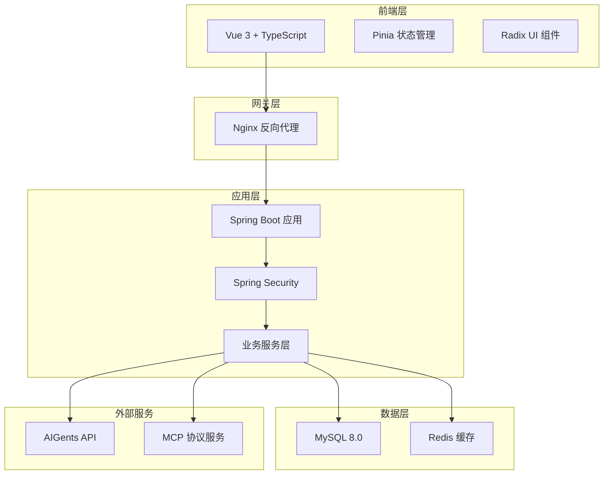
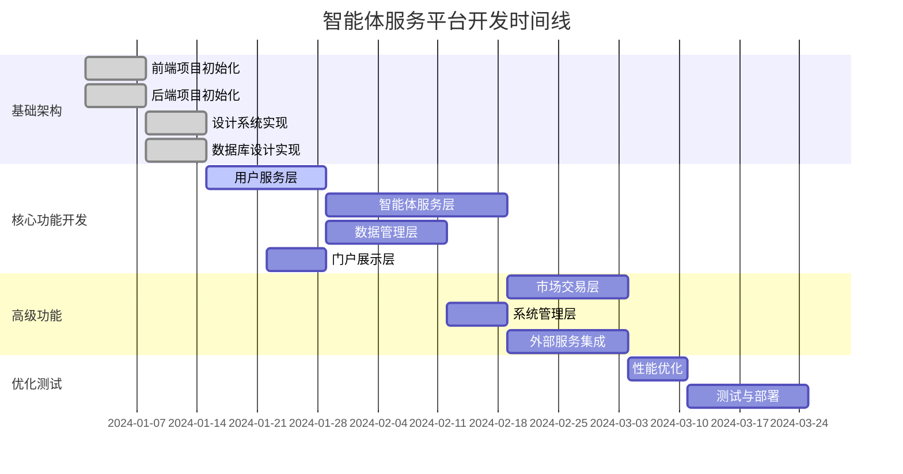

# 智能体服务平台系统开发规划与技术路线图

## 1. 系统开发规划

### 1.1 技术栈选型与架构图

#### 1.1.1 前端技术栈

```
前端架构
├── Vue 3.4+ (Composition API)
├── TypeScript 5.0+
├── Vite 5.0+ (构建工具)
├── Pinia (状态管理)
├── Vue Router 4 (路由管理)
├── Radix UI (无样式组件库)
└── Tailwind CSS (样式框架)
```

**选型理由**：
- Vue 3 Composition API 提供更好的类型推导和逻辑复用
- TypeScript 确保类型安全，减少运行时错误
- Radix UI 提供无障碍访问的组件基础
- Vite 提供极速的开发体验

#### 1.1.2 后端技术栈

```
后端架构
├── Spring Boot 2.7.x
├── Java 8
├── Maven 3.8+
├── MySQL 8.0
├── MyBatis-Plus 3.5+
├── Spring Security 5.7+
├── Redis 7.0+ (缓存)
└── Swagger 3.0+ (API文档)
```

**选型理由**：
- Spring Boot 2.7 稳定版本，生态成熟
- MyBatis-Plus 简化CRUD操作，避免JPA过度抽象
- MySQL 8.0 高性能关系型数据库
- Redis 缓存AI响应结果，提升性能

#### 1.1.3 系统架构图



### 1.2 前后端开发任务分解

#### 1.2.1 前端开发任务（按模块划分）

##### 阶段一：基础架构搭建（2周）

**任务1.1：项目初始化与环境配置**
- 创建Vue 3 + TypeScript + Vite项目
- 配置ESLint、Prettier代码规范
- 集成Radix UI和Tailwind CSS
- 配置Pinia状态管理
- 设置Vue Router路由结构
- 配置开发、测试、生产环境

**任务1.2：设计系统实现**
- 实现设计令牌系统（颜色、字体、间距）
- 创建基础组件库（Button、Input、Card等）
- 实现响应式布局系统
- 建立组件文档和Storybook

##### 阶段二：核心页面开发（6周）

**任务2.1：门户展示层（1周）**
- 首页Landing Page
- 产品介绍页面
- 定价页面
- 关于我们页面

**任务2.2：用户服务层（2周）**
- 用户注册/登录页面
- 用户个人中心
- 订阅管理页面
- API密钥管理
- 账单与支付页面

**任务2.3：智能体服务层（2周）**
- 智能体总览页面
- Playground交互界面
- 智能体配置页面
- MCP模型管理
- 记忆功能管理

**任务2.4：数据管理层（1周）**
- 数据集管理页面
- 数据上传与处理界面
- 数据集详情页面

##### 阶段三：高级功能开发（4周）

**任务3.1：市场交易层（2周）**
- MCP市场页面
- 模型详情页面
- 购买与订阅流程

**任务3.2：系统管理层（1周）**
- 管理后台界面
- 系统监控面板
- 用户管理页面

**任务3.3：优化与测试（1周）**
- 性能优化
- 单元测试编写
- E2E测试
- 浏览器兼容性测试

#### 1.2.2 后端开发任务（按模块划分）

##### 阶段一：基础架构搭建（2周）

**任务1.1：项目初始化**
- 创建Spring Boot项目结构
- 配置Maven依赖管理
- 集成MyBatis-Plus和MySQL
- 配置Spring Security基础认证
- 设置多环境配置

**任务1.2：数据库设计实现**
- 执行数据库建表脚本
- 创建Entity实体类
- 配置MyBatis-Plus代码生成器
- 实现基础CRUD操作

##### 阶段二：核心API开发（8周）

**任务2.1：用户服务层API（2周）**
- 用户注册/登录接口
- JWT认证机制
- 用户信息管理API
- 角色权限管理API
- 订阅服务API

**任务2.2：智能体服务层API（3周）**
- 智能体实例管理API
- Playground对话接口
- MCP配置管理API
- 记忆功能API

**任务2.3：数据管理层API（2周）**
- 数据集上传接口
- 数据处理状态API
- 数据集查询与管理API
- 文件存储服务

**任务2.4：系统管理层API（1周）**
- 系统监控API
- 日志管理API
- 配置管理API

##### 阶段三：集成与优化（3周）

**任务3.1：外部服务集成（2周）**
- AIGents API集成
- MCP协议实现
- 支付服务集成
- 邮件服务集成

**任务3.2：性能优化（1周）**
- Redis缓存实现
- 数据库查询优化
- API响应时间优化
- 并发处理优化

### 1.3 里程碑节点与交付物定义

#### 里程碑1：基础架构完成（第2周末）

**前端交付物**：
- ✅ 项目脚手架搭建完成
- ✅ 设计系统基础组件库
- ✅ 路由和状态管理配置
- ✅ 开发环境配置文档

**后端交付物**：
- ✅ Spring Boot项目结构
- ✅ 数据库表结构创建
- ✅ 基础CRUD接口
- ✅ 认证授权机制

**验收标准**：
- 前后端项目可正常启动
- 基础API接口可正常调用
- 数据库连接正常
- 代码规范检查通过

#### 里程碑2：核心功能MVP（第8周末）

**前端交付物**：
- ✅ 用户注册登录流程
- ✅ 智能体Playground基础功能
- ✅ 数据集管理界面
- ✅ 响应式布局适配

**后端交付物**：
- ✅ 用户服务完整API
- ✅ 智能体服务核心API
- ✅ 数据管理基础API
- ✅ AIGents集成接口

**验收标准**：
- 用户可完成注册登录
- 可创建和配置智能体
- 可上传和管理数据集
- 智能体可进行基础对话

#### 里程碑3：完整功能交付（第13周末）

**前端交付物**：
- ✅ 所有页面功能完成
- ✅ MCP市场功能
- ✅ 管理后台界面
- ✅ 性能优化完成

**后端交付物**：
- ✅ 所有API接口完成
- ✅ MCP协议完整实现
- ✅ 系统监控功能
- ✅ 性能优化完成

**验收标准**：
- 所有功能模块正常运行
- 性能指标达到要求
- 安全测试通过
- 文档完整齐全

#### 里程碑4：生产就绪（第15周末）

**交付物**：
- ✅ 生产环境部署
- ✅ 监控告警系统
- ✅ 备份恢复方案
- ✅ 运维文档

**验收标准**：
- 生产环境稳定运行
- 监控指标正常
- 灾备方案验证通过
- 用户验收测试通过

## 2. 开发时间线



## 3. 技术风险评估与应对

### 3.1 高风险项

**风险2：MCP协议实现难度**
- **风险描述**：MCP协议规范理解和实现可能存在偏差
- **应对策略**：
  - 深入研究MCP协议文档
  - 实现渐进式集成
  - 建立测试用例验证

### 3.2 中风险项

**风险3：前端组件库兼容性**
- **风险描述**：Radix UI与Vue 3集成可能存在兼容问题
- **应对策略**：
  - 提前进行技术验证
  - 准备备选方案（Headless UI）

**风险4：数据库性能瓶颈**
- **风险描述**：大量AI调用日志可能影响数据库性能
- **应对策略**：
  - 实现日志分表策略
  - 使用Redis缓存热点数据
  - 定期清理历史数据

### 3.3 低风险项

**风险5：Spring Boot版本兼容**
- **应对策略**：使用稳定的2.7.x版本

**风险6：前端构建优化**
- **应对策略**：使用Vite的成熟优化方案

## 4. 资源配置建议

### 4.1 人员配置

**前端团队（2人）**：
- 高级前端工程师 × 1（负责架构设计和核心功能）
- 中级前端工程师 × 1（负责页面开发和组件实现）

**后端团队（2人）**：
- 高级后端工程师 × 1（负责架构设计和核心API）
- 中级后端工程师 × 1（负责业务API和数据库设计）

**全栈支持（1人）**：
- 全栈工程师 × 1（负责集成测试和部署运维）

### 4.2 开发环境

**硬件要求**：
- 开发机：16GB内存，SSD硬盘
- 测试服务器：8核16GB，100GB存储
- 生产服务器：16核32GB，500GB存储

**软件工具**：
- IDE：VS Code / IntelliJ IDEA
- 版本控制：Git + GitLab
- 项目管理：Jira / Notion
- 文档协作：Confluence / 飞书文档

## 5. 质量保证策略


### 5.2 性能指标

- **页面加载时间**：< 2秒
- **API响应时间**：< 500ms
- **并发用户数**：支持1000+
- **系统可用性**：> 99.5%

### 5.3 安全要求

- **认证授权**：JWT + Spring Security
- **数据加密**：HTTPS + 数据库字段加密
- **输入验证**：前后端双重验证
- **安全扫描**：定期进行安全漏洞扫描

---

**文档版本**：v1.0  
**创建日期**：2024-01-15  
**更新日期**：2024-01-15  
**负责人**：开发团队